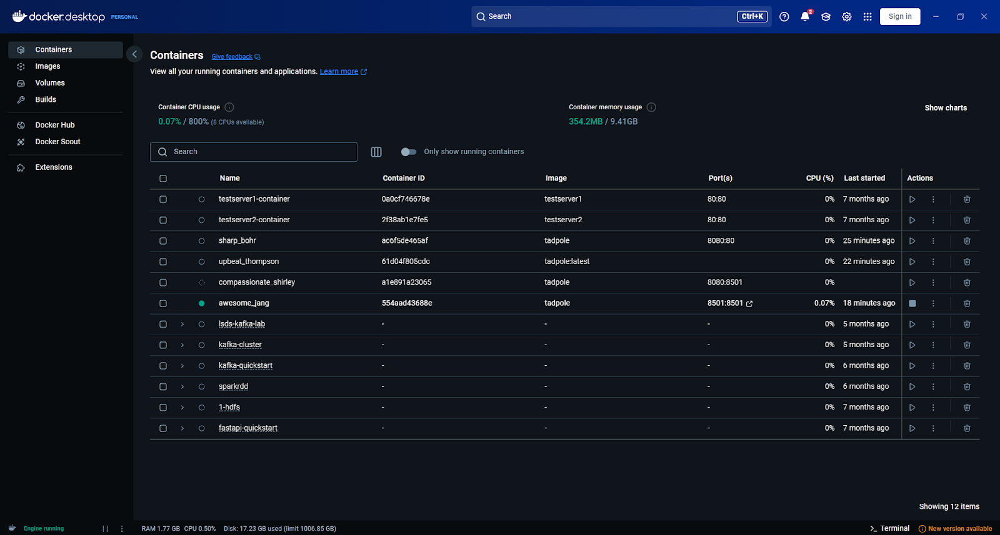
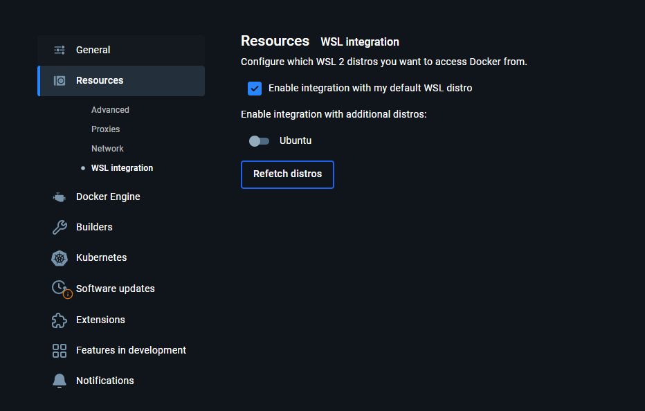
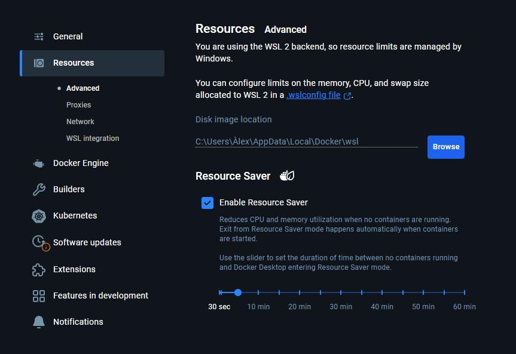
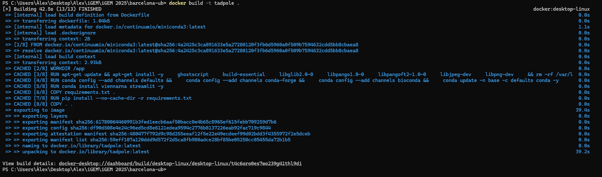
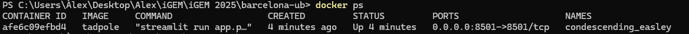
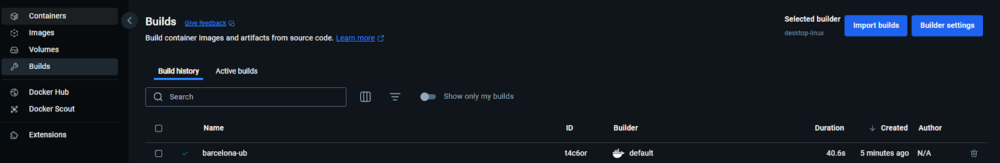
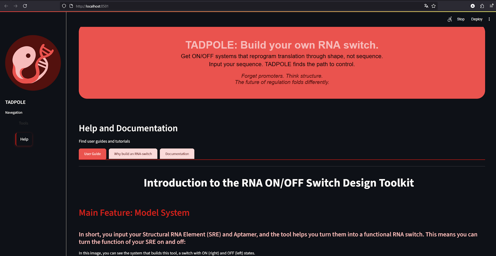
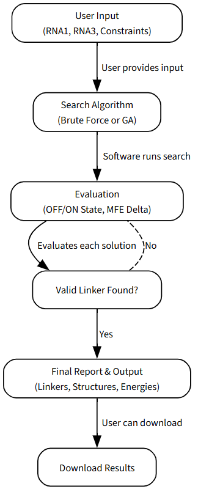

# Team Barcelona-UB 2025 Software Tool: TADPOLE

## Description

**TADPOLE** is a computational tool for identifying optimal linker sequences in functional RNA switches. It is designed to help you build your own RNA ON/OFF systems that reprogram translation through shape, not sequence.

Forget promoters, think aptamers. The future of regulation is here.

In short, you input your Structural RNA Element (SRE) and Aptamer, and the tool helps you turn them into a functional RNA switch. This means you can turn the function of your SRE on and off.

---

## Usage

### Online Tool (Recommended)

For a direct and user-friendly experience, TADPOLE is deployed as a web application. Use the tool online with no installation required at: [https://toolkit-m4g6.onrender.com](https://toolkit-m4g6.onrender.com)


### Local Installation (For Developers)

#### Option 1: Package
For those who want to expand the code or run it locally.

#### Requirements

* **Python 3.8+**: The project requires a recent version of Python.
* **Ghostscript**: This is needed for structure visualisation.

#### Steps

1.  **Clone the repository**:
    ```bash
    git clone [https://gitlab.igem.org/2025/software-tools/barcelona-ub/](https://gitlab.igem.org/2025/software-tools/barcelona-ub/)
    ```

2.  **Install Ghostscript** (Required for visualization):
    ```bash
    sudo apt-get update && sudo apt-get install -y ghostscript
    ```

3.  **Set up a virtual environment** (recommended):
    ```bash
    python3 -m venv venv_tadpole
    source venv_tadpole/bin/activate
    ```

4.  **Install dependencies and the package**:
    Make sure you are in the directory that contains `setup.py` and `requirements.txt`.
    ```bash
    pip install -r requirements.txt
    pip install .
    ```

Now, the `tadpole` package is installed locally and you can use its modules and the CLI.

---
#### Option 2: Docker Usage (Advanced)

For users who prefer a containerised, isolated environment.


### Installation

#### Requirements

* **Docker Desktop**: You must have Docker Desktop installed on your system.
* **WSL (Windows Subsystem for Linux)**: If you are on a Windows machine, ensure WSL is installed and that Docker is integrated with it.

#### Steps

1.  **Open a terminal and clone the repository** in your desired folder.
    ```bash
    git clone [https://gitlab.igem.org/2025/software-tools/barcelona-ub/](https://gitlab.igem.org/2025/software-tools/barcelona-ub/)
    ```
    

2.  **Navigate to the folder** with the `Dockerfile`.
    ```bash
    cd barcelona-ub
    ```

3.  **Open Docker Desktop** and check that it is running.
    ```bash
    docker desktop
    ```
    If it is not installed, download Docker Desktop from [https://www.docker.com/products/docker-desktop/](https://www.docker.com/products/docker-desktop/), install, and open it.

4.  **Check for WSL integration** if you are on Windows.
    ```bash
    wsl --version
    ```
    If not installed, run:
    ```bash
    wsl --install
    ```
    When using Windows, confirm that Docker is integrated with WSL by checking `Docker Desktop → Settings → Resources → WSL Integration`. Make sure this is checked:

    

    For further confirmation, it should appear this when opening the Resources tab:

    

5.  **Build the Docker Image**:
    ```bash
    docker build -t tadpole .
    ```
    It should take some time.
    
    Check if the image is created by using the command line:
    ```bash
    docker ps
    ```
    
    Or use Docker Desktop:
    

6.  **Run the Container**:
    ```bash
    docker run -d -p 8501:8501 tadpole
    ```
    It is important that you only use port `8501`, as any other port will not work. You can check the status of the image and container in the Docker Desktop, Images Tab:
    
    

7.  **Access the Application**:
    Then open a browser tab and navigate to:
    ```
    http://localhost:8501
    ```
    

8.  **Container Management**: Once finished, you can stop the container in Docker Desktop or by command.
    * To check running containers, look for the one with the `tadpole` image:
        ```bash
        docker ps
        ```
    * Copy the `CONTAINER ID` or `NAMES`, then run:
        ```bash
        docker stop <container_id_or_name>
        ```
    * In case you want to restart:
        ```bash
        docker start <container_id_or_name>
        ```
    * To remove/delete the container and image:
        * Container:
            ```bash
            docker rm <container_id_or_name>
            ```
        * Image:
            ```bash
            docker rmi <image_id_or_name>
            ```
    The last two steps can also be done using Docker Desktop.


### API Usage (Limited)

To interact with TADPOLE's core functionality through a REST API.

1.  **Start the API server**:
    In the first terminal, navigate to the project directory and run the API script.
    ```bash
    python api_example.py
    ```
    This will start the development server at `http://127.0.0.1:5000`.

2.  **Test the API endpoints**:
    In a second terminal, run the test script to send requests to the endpoints.
    ```bash
    python test_api.py
    ```
    This will test the structure prediction, genetic algorithm, and linker search endpoints, and display the responses in your terminal.
---

## Core Methodology

The design process is a multi-step pipeline based on computational and biological principles:

* **Constraint-Based Design**: Users provide a desired "ON" state structure in dot-bracket notation as a constraint for the search algorithms.
* **Thermodynamic Prediction**: ViennaRNA predicts Minimum Free Energy (MFE) secondary structures. The key evaluation metric is **ΔMFE**, the difference in MFE between the "ON" and "OFF" states.
* **Dual Search Algorithms**:
    * **Brute-Force Search**: Explores every nucleotide combination. Guarantees all solutions but is only feasible for short linkers.
    * **Genetic Algorithm (GA)**: Efficiently explores large design spaces via mutation, crossover, and a custom fitness function.
* **Evaluation**: Candidates are assessed for:
    * **ΔMFE**: Difference between "ON" and "OFF" states.
    * **SRE preservation**: The "ON" state must maintain the functional SRE structure.
    * **OFF-state disruption**: The "OFF" state should disrupt the SRE.
    * **Base pair interactions**: Number and quality of pairings between system elements.
* **Structural and Diversity Analysis**: Designs are clustered to identify structural families and assess diversity, helping users select unique and robust solutions.

---

## Standards and Interoperability

TADPOLE adheres to open standards and common file formats (e.g., FASTA). All valid designs are exported in **SBOL3 JSON-LD** format, ensuring compatibility with tools such as SynBioHub, SBOLDesigner, and other pipelines. This ensures results are **FAIR**: Findable, Accessible, Interoperable, and Reusable.

---

## Software Architecture

TADPOLE is built with a modular Python architecture for clarity and maintainability:

| Module | Core Functionality |
| :--- | :--- |
| `app.py` | Streamlit UI and workflow control |
| `genetic_algorithm.py` | Core logic for the GA |
| `search.py` | Brute-force search and filtering |
| `input_utils.py` | Parsing of input files |
| `rna_structures.py` | RNA structure parsing and manipulation |
| `rna_mutation.py` | Functions for sequence mutation |
| `structure.py` | RNA structure prediction (ViennaRNA) |
| `conservation.py` | Sequence/structure conservation analysis |
| `rna_cluster.py` | Structural clustering and diversity metrics |
| `visualization.py` | Generation of RNA structure plots |
| `SBOL.py` | Export to SBOL3 JSON-LD format |
| `io_tools.py` | File I/O and ZIP archive creation |

---

## Outputs

Each run produces a ZIP archive containing:

* **`report.txt`**: A detailed summary, including search parameters and results.
* **`diversity.png`**: A bar plot of structural diversity (unique vs. total structures).
* **`delta_mfe.png`**: A histogram of ΔMFE distribution, indicating switching efficiency.
* **`sbol_document.jsonld`**: The final designs in machine-readable SBOL3 format.
* **`plots/`**: A directory with high-resolution RNA structure plots highlighting SRE, linker, and aptamer.

---

## Contributing

We welcome contributions! To contribute:

1.  Fork the repository and create a feature branch.
2.  Run tests and ensure code passes linting.
3.  Submit a pull request with a clear description of your changes.

**Future Work**:

* **Algorithm Expansion**: Add more optimization strategies.
* **Aptamer Expansion**: Test different aptamers and set default values automatically.
* **Experimental Validation**: Protocols for synthesis, fluorescence assays...
* **Performance Optimization**: Improve speed and reliability of core routines and external calls.

---

## Authors and Acknowledgements

This software was developed by **Team Barcelona-UB 2025**.

Special thanks to:

* The developers of ViennaRNA and SBOL for foundational tools and standards.
* Open-source libraries: Streamlit, Biopython, and scikit-learn.
* The iGEM Foundation for providing a platform and resources.

---

## License

This software is licensed under the **Creative Commons Attribution 4.0 International Public License (CC BY 4.0)**.

You are free to:
* **Share** — copy and redistribute the material in any medium or format.
* **Adapt** — remix, transform, and build upon the material, even commercially.

Under the following condition:
* **Attribution** — You must give appropriate credit, provide a link to the license, and indicate if changes were made. You may do so in any reasonable manner, but not in a way that suggests the licensor endorses you or your use.
